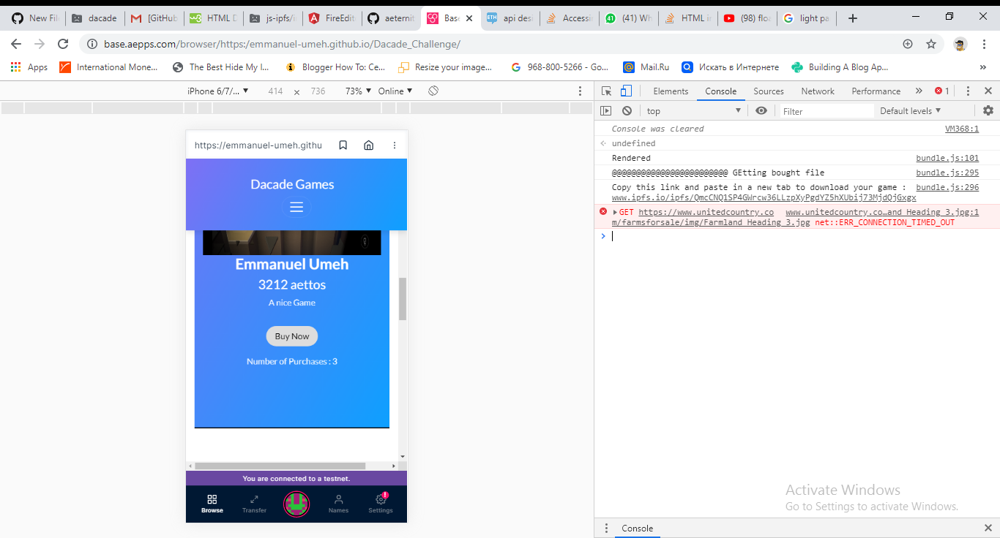
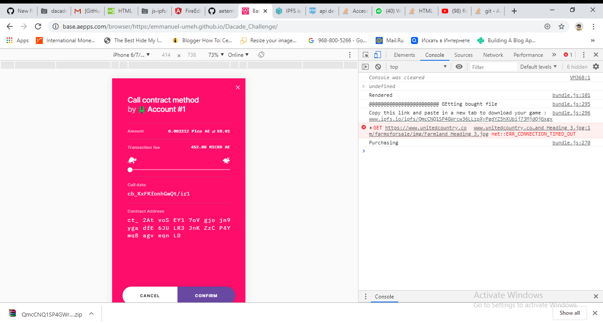
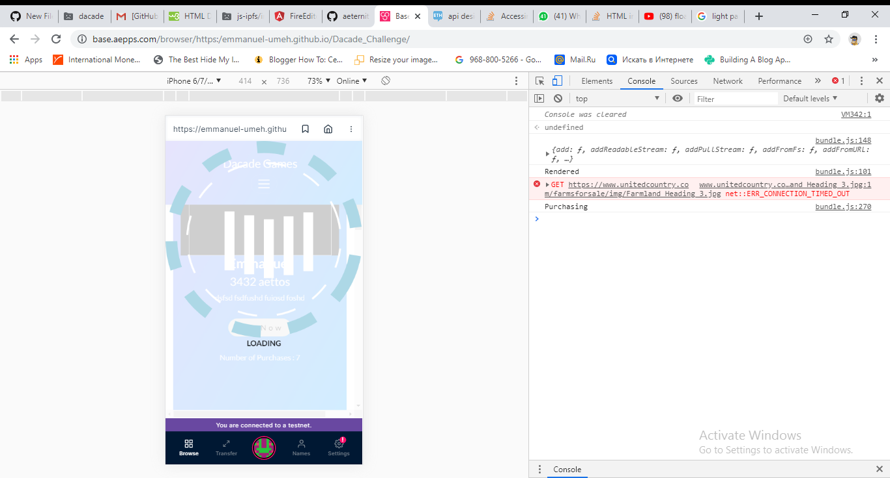
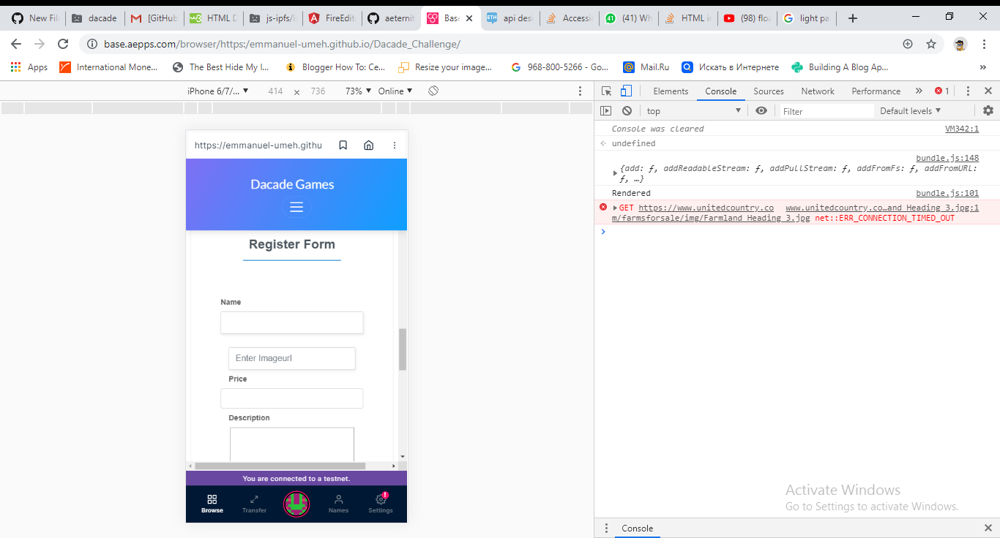

Dacade Games is a dapp built on the aeternity blockchain
This is a platform where users can upload their games to the dapp via ipfs and have people buy these games via the aeternity blockchain.

Instructions:

To use this dapp you need to do the following:
1. Copy this link https://emmanuel-umeh.github.io/Dacade_Challenge/ 
2. Go to www.baseapps.com/browser in mobile view on your browser
3. Paste the link in the field and enter

To Purchase a game, simply click the purchase button on the game you like.

 
Click Confirm on the popup that will be rendered.

Wait for the loading gif to dissapear.

A link will be generated for you in the console due to the limitations of baseapp.
Copy this link and paste in a new tab.
Wait for the download to begin.
Enjoy:)

To Register a game, scroll down to the Register form and fill the required details correctly.

!!!!!!!!!!!!!!!!!!!!!!!!! Ensure your GAME file is compressed in a ZIP FORMAT before uploading it!!!!!!!!!!!!!!!!!!!!!!!!

Allow the prompt that will be created. 
Wait for your games to be added to the list of games on the main screen.

How To Make Contributions:
Fork the code
Have a knowledge of browserify
If you make changes to the index.js file, run the command on the Command Line "npm start bundle" so the code gets updated on the bundle.js.
Make a pull request
